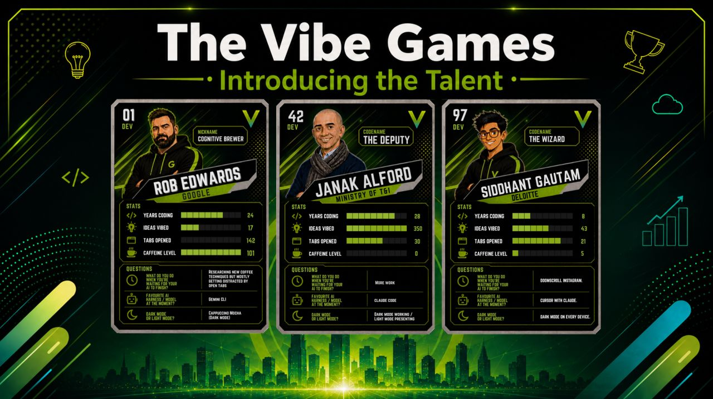
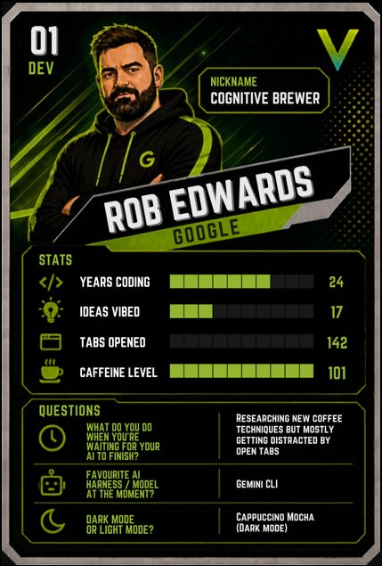
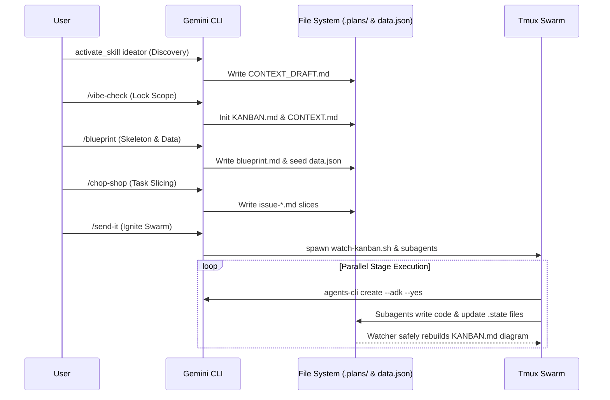
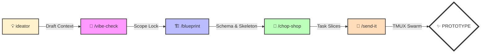

# 🚀 Vibe Games Gemini CLI Extension (Hacker Vibe Edition)

A ruthless, high-velocity extension for the Gemini CLI, specifically optimized for building, validating, and demoing agentic prototypes in under 40 minutes for the **Vibe Games Competition**.

This extension abandons traditional, bloated software development lifecycles in favor of a deterministic, 5-step terminal pipeline that launches a visually stunning `tmux` swarm of AI subagents.

---

## 📺 Interactive Showcase & Slide Deck

The project includes a stunning, local-first interactive presentation showcasing the development process, architecture, and live demo trace of **ClassVibe AI**.

👉 **[Launch the Live Presentation](https://sapientcoffee.github.io/vibe-games/)** *(Or open [index.html](./index.html) locally)*

---

## 🏎️ The Winning Playbook: The Hacker Vibe Pipeline

In a 40-minute live sprint, context switching is fatal. This pipeline replaces interactive manual scaffolding with a straight-line, data-first execution path starting with pre-flight automated ideation.

### The Swarm Architecture

### The Hacker Vibe Pipeline Flow

---

## 🔥 The Pipeline Commands

### 0. `ideator` Skill (Pre-Flight Discovery)
Deconstructs any raw product or hackathon prompt into structured ideas.
*   **Action:** Dynamically researches domain friction points, designs target personas, details high-impact Customer User Journeys (CUJs), aligns with ADK topologies, and drafts a mock `data.json` schema.
*   **Result:** Outputs `.plans/CONTEXT_DRAFT.md` to feed into the `/vibe-check` process, allowing for 100% future-proof, generic ideation on any prompt.

### 1. `/vibe-check` (The Pit Stop)
Rapid-fire Hackathon Q&A to nail down the core demo scope.
*   **Action:** Reads `.plans/CONTEXT_DRAFT.md`, asks a strict maximum of 3-5 Yes/No default questions to choose, refine, and lock in the transactional flow and edge cases.
*   **Result:** Outputs the final context payload (`CONTEXT.md`) and initializes the `KANBAN.md` tracker.

### 2. `/blueprint` (The Spellbook)
Converts the raw vibe-check context into a strict Technical Skeleton.
*   **Action:** Generates the ADK System Prompt, defines Deep Modules, and—crucially—**seeds the initial `data.json` database** with 3-5 realistic mock records based on the audience's chosen use case.
*   **Result:** The immutable data schema is locked in for the subagents.

### 3. `/chop-shop` (The Slicer)
Breaks the blueprint into independently-grabbable parallel tasks.
*   **Action:** Slices the build into max 4 tasks tagged with `[FRONTEND]`, `[BACKEND]`, or `[ADK-INIT]`. 
*   **Result:** Populates the `To Do` column of the live Mermaid Kanban board.

### 4. `/send-it` (The Swarm Orchestrator) **[STAGE MAGIC]**
Ignites the parallel execution engine.
*   **Action:** Spawns specialized subagents (`vibe-adk-hacker`, `vibe-ui-artist`) into isolated `tmux` panes.
*   **Result:** The audience watches multiple terminal panes stream code simultaneously while the main pane dynamically updates the Mermaid Kanban board as tasks move to `DONE`.

---

## 🎯 Architecture & Infrastructure Rules

1.  **The Agents CLI Advantage**: Subagents MUST scaffold the backend using `agents-cli create <name> --adk --yes`. Zero manual boilerplate.
2.  **Model Selection Strategy**: Exclusively use `gemini-2.5-flash` or `gemini-3.1-flash-lite` for prototyping. Run a pre-flight model check to avoid 404s.
3.  **Data-First Execution**: The dynamic `data.json` schema generated by the Blueprint is the immutable law. No Postgres, no Firestore. Instantaneous local JSON reads/writes only.
4.  **Local-First / Zero-Cloud**: ALL infrastructure (UI, APIs) runs locally. The ONLY external dependency is the LLM via `GOOGLE_API_KEY`.
5.  **CORS-by-Default**: ADK backends MUST pre-emptively include CORS middleware to ensure seamless React UI connectivity.
6.  **State Directory Safety**: Subagents NEVER write directly to `.plans/KANBAN.md`. They write to isolated `.state` files; a background daemon aggregates them to rebuild the board safely.
7.  **Spectator Logging**: Use the Gold Standard Emoji Set (📥, 🧠, 🛠️, 💾, ✅) and `flush=True` for real-time stage visibility.
8.  **Zero Tests**: Standard TDD is suspended. If the endpoint returns valid JSON, it ships.

---

## 🗑️ Deprecated Commands (Pruned for Speed)

The following legacy commands have been removed as they introduce too much friction or hallucination risk for a 40-minute sprint:
*   `/grill-me`, `/to-prd`, `/to-slices`, `/to-code` (Replaced by the Hacker Vibe Pipeline).
*   `/vibe:blitz`, `/vibe:kickoff`, `/vibe:scaffold` (Replaced by `agents-cli` integrated initialization).

---

## 📜 License

Copyright 2026 Google LLC.
Licensed under the Apache License, Version 2.0. See [LICENSE](./LICENSE) for details.