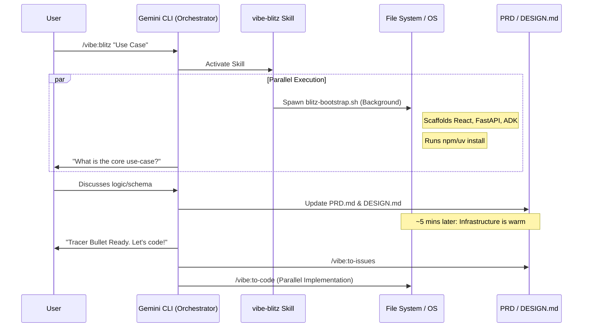

# Vibe Games Gemini CLI Extension 🏎️💨

A high-velocity extension for the Gemini CLI, specifically optimized for building and validating agentic prototypes in high-pressure environments like the **Vibe Games Competition**.

## The Winning Playbook: "The Blitz" 🚀

In a 40-minute sprint, Turn 1 is for Infrastructure. Use the **Blitz Protocol** to start your design and your dev environment simultaneously.

### High-Speed Workflow

## Primary Commands

### `/vibe:blitz [use-case]` **(RECOMMENDED)**
The ultimate sprint starter.
- **Background:** Fires `blitz-bootstrap.sh` to build React (User/Admin), FastAPI (Bridge), and ADK (Agent) while installing all dependencies.
- **Foreground:** Immediately starts the design interview to build your `PRD.md` and `data.json` schema.
- **Result:** You are ready to code the moment you finish your plan.

### `/vibe:plan`
Initiates a high-velocity planning session (PRD -> Slices).

### `/vibe:to-prd` / `/vibe:to-issues`
Core utilities for converting chat context into actionable implementation tickets in `.plan/`.

## Deprecated / Legacy Commands (Use with Caution)

> These commands are slower or redundant given the new Blitz workflow.

- **`/vibe:scaffold`**: Use `/vibe:blitz` instead. Blitz does everything scaffold does but in the background while you plan.
- **`/vibe:kickoff`**: Redundant. Uses tmux panes for setup which can be slower to navigate in a sprint than the Blitz's integrated workflow.
- **`/vibe:slice`**: Replaced by the more robust `/vibe:to-issues` + `vibe-blitz` coordination.

## Skills Included

- **`vibe-blitz`**: The high-speed orchestrator and bootstrap engine.
- **`vibe-bridge`**: Generates the FastAPI connective tissue.
- **`to-code`**: Orchestrates parallel implementation across multiple panes.
- **`tmux-orchestrator`**: Manages terminal panes for a live dev environment.

## Architecture: The "Tracer Bullet" 🎯
Strictly enforced by `DESIGN.md`:
1. **User UI (3000)**: React + Tailwind.
2. **Admin UI (3001)**: Management dashboard.
3. **Bridge API (8000)**: FastAPI (The Hub).
4. **Agent**: ADK Agent.
5. **Persistence**: Local `data/data.json` (Zero-Cloud).

## License

Copyright 2026 Google LLC.
Licensed under the Apache License, Version 2.0. See [LICENSE](./LICENSE) for details.
