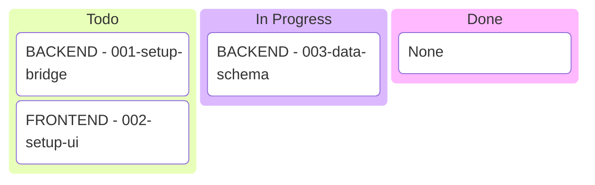

# Kanban Generation Logic

When generating or updating `.plans/KANBAN.md`, you MUST write the entire file as a single Mermaid code block. Do NOT use single-line formatting.

### Required File Content Template:


## Strict Formatting Rules
1. **Block Markers**: The file MUST start with ` ```mermaid ` and end with ` ``` `.
2. **Newlines**: Every column and every item MUST be on its own line.
3. **No Brackets**: Do NOT use `[` or `]`. They are interpreted as shape delimiters and cause parse errors. Use `BACKEND -` or `FRONTEND -` instead.
4. **No Quotes**: Do NOT use double quotes `"`. They can confuse the lexer in some versions of the kanban diagram.
5. **Indentation**: 
   - Column headers (e.g., `Todo`): 2 spaces.
   - Items: 4 spaces.
6. **Empty Columns**: If a column has no items, add a `None` placeholder.
7. **Columns**: Use exactly `Todo`, `In Progress`, `Done`, and `Blocked/Failed`.
