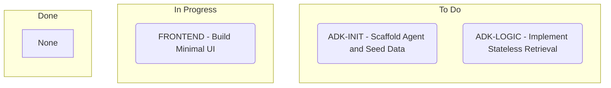

# Kanban Generation Logic

When compiling or updating `.plans/KANBAN.md`, you MUST write the entire file as a single Mermaid code block using the standard `flowchart TD` syntax with subgraphs representing the lanes.

### Required File Content Template:


## Strict Formatting Rules
1. **Block Markers**: The file MUST start with ` ```mermaid ` and end with ` ``` `.
2. **Subgraphs**: Use exactly `subgraph Todo ["To Do"]`, `subgraph InProgress ["In Progress"]`, and `subgraph Done ["Done"]`.
3. **No Brackets inside Nodes**: Do NOT use `[` or `]` inside the node text (e.g. `issue-1(...)`), as it conflicts with Mermaid shape delimiters. Format tags as `TAG -` (e.g., `ADK-INIT -`).
4. **Empty Columns**: If a column has no active issues, put a single node named `None` inside it (e.g., `None`).
